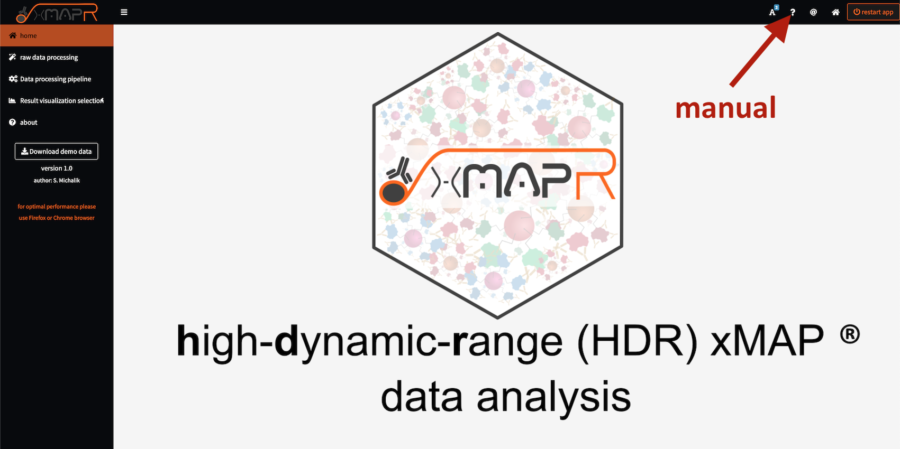
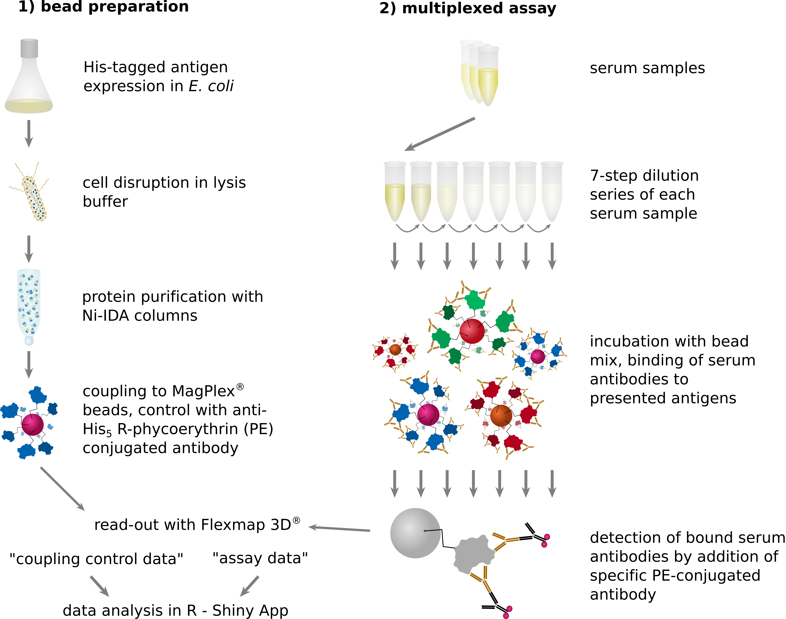
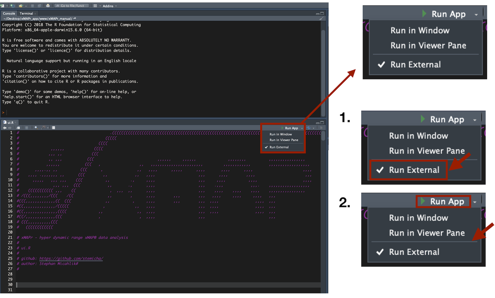

```{r setup, include=FALSE}
knitr::opts_chunk$set(echo = TRUE)
```

```{r logo,echo=F,fig.align='center'}

```

<hr>

functional version of xMAPr app on shinyapps.io (*25 active hours*): [https://michalik.shinyapps.io/xMAPr_app/](https://michalik.shinyapps.io/xMAPr_app/){target="_blank"}

**if 25 active hours are reached the app will be disabled until the next month cycle start**


## Citation of xMAPr

Meyer, T., Schmidt, F., Steinke, J., Bröker, B., Völker, U., Michalik, S. (2019). Technical report: xMAPr – High-dynamic-range (HDR) quantification of antigen-specific antibody binding. Journal of Proteomics https://dx.doi.org/10.1016/j.jprot.2019.103577


## protocol for serological assay workflow

[xMAPr - dilution based serological assay workflow protocol](www/xMAPr_serological_assay_protocol.pdf)

## Manual

```{r ManualButton,echo=F,fig.align='center'}

```

## Introduction

Measuring the antibody response to multiple antigens in biofluids can be achieved using the xMAP® technology supplied by Luminex®. For the multiplexing assay all antigens are covalently bound to small paramagnetic particles (MagPlex™) of unique fluorescence dye combination making it possible to distinguish between the mixed spheres in the full assay.

The immune response to some antigens can be extremely strong and extremely weak to others. Thus, the quantitative dynamic range of analysis extends over several orders of magnitude. In a standard measurement, the patient's plasma/serum is diluted 1000-fold and / or 10000-fold. Since this commonly used approach carries the risk of generating quantitative data close to the detection limit when including multiple antigens with a wide variance in the expected antibody responses. This results in error prone data sets making the interpretation of the data very difficult. An advanced approach has been developed to overcome this issue including a serial dilution based measurement of samples granting results derived from the linear range of each antigen.

```{r workflow,echo=F,fig.cap="serological assay workflow using the xMAP® technology"}

```

## Download xMAPr from GitHub and run locally

### Requirements

- R (min. version 3.5.1) [https://cran.r-project.org](https://cran.r-project.org)
- RStudio Desktop (min. version 1.1.414) [https://www.rstudio.com/products/rstudio-desktop/](https://www.rstudio.com/products/rstudio-desktop/)
- **Windows user MUST install RTools** [https://cran.r-project.org/bin/windows/Rtools/](https://cran.r-project.org/bin/windows/Rtools/) on **C:** drive (final path: C:\\RTools)

other demanding R packages will be installed on the first startup of the xMAPr app (this might take a while)

### Running the app locally

#### Method 1

```{r,eval=F}
#install shiny package
install.packages("shiny")
#install xMAPr_app
shiny::runGitHub(repo = "xMAPr_app",username = "stemicha")
#this might take a while for downloading and installation
```


#### Method 2
1. download the app from github [https://github.com/stemicha/xMAPr_app](https://github.com/stemicha/xMAPr_app) by using the **clone or download** button
2. after extracting the zip file please open the **ui.R** or **server.R** in RStudio
3. select **Run external**
4. press **Run App** to start the app (first run will take a while, due to package installations)

```{r RunAppLocally,echo=F,fig.align='center'}

```


## Used packages for the xMAPr app

- R: A Language and Environment for Statistical Computing (R Core Team (2018))
- bookdown: Authoring Books and Technical Documents with R Markdown (Xie (2018a))
- rmarkdown: Dynamic Documents for R (Allaire et al. (2018))
- data.table: Extension of data.frame (Dowle and Srinivasan (2018))
- DT: A Wrapper of the JavaScript Library ‘DataTables’ (Xie (2018b))
- factoextra: Extract and Visualize the Results of Multivariate Data Analyses (Kassambara and Mundt (2017))
- FactoMineR: Multivariate Exploratory Data Analysis and Data Mining (Husson et al. (2018))
- ggrepel: Automatically Position Non-Overlapping Text Labels with ‘ggplot2’ (Slowikowski (2018))
- ggsignif: Significance Brackets for ‘ggplot2’ (Ahlmann-Eltze (2017))
- gridExtra: Miscellaneous Functions for “Grid” Graphics (Auguie (2017))
- heatmaply: Interactive Cluster Heat Maps Using ‘plotly’ (Galili (2018))
- knitr: A General-Purpose Package for Dynamic Report Generation in R (Xie (2018c))
- magrittr: A Forward-Pipe Operator for R (Bache and Wickham (2014))
- minpack.lm: R Interface to the Levenberg-Marquardt Nonlinear Least-Squares Algorithm Found in MINPACK, Plus Support for Bounds (Elzhov et al. (2016))
- plotly: Create Interactive Web Graphics via ‘plotly.js’ (Sievert et al. (2018))
- RColorBrewer: ColorBrewer Palettes (Neuwirth (2014))
- reshape: Flexibly Reshape Data ((???))
- reshape2: Flexibly Reshape Data: A Reboot of the Reshape Package ((???))
- rlang: Functions for Base Types and Core R and ‘Tidyverse’ Features (Henry and Wickham (2018))
- scales: Scale Functions for Visualization (Wickham and Seidel (2018))
- shiny: Web Application Framework for R (Chang et al. (2018))
- shinyalert: Easily Create Pretty Popup Messages (Modals) in ‘Shiny’ (Attali and Edwards (2018))
- shinyBS: Twitter Bootstrap Components for Shiny (Bailey (2015))
- shinydashboard: Create Dashboards with ‘Shiny’ (Chang and Borges Ribeiro (2018))
- shinyFiles: A Server-Side File System Viewer for Shiny (Pedersen, Nijs, and Nantz (2018))
- shinyjs: Easily Improve the User Experience of Your Shiny Apps in Seconds (Attali (2018))
- shinyWidgets: Custom Inputs Widgets for Shiny (Perrier, Meyer, and Granjon (2018))
- tidyverse: Easily Install and Load the ‘Tidyverse’ (Wickham (2018))

### References

R Core Team. 2018. R: A Language and Environment for Statistical Computing. Vienna, Austria: R Foundation for Statistical Computing. https://www.R-project.org/.

Xie, Yihui. 2018a. Bookdown: Authoring Books and Technical Documents with R Markdown. https://github.com/rstudio/bookdown.

Allaire, JJ, Yihui Xie, Jonathan McPherson, Javier Luraschi, Kevin Ushey, Aron Atkins, Hadley Wickham, Joe Cheng, and Winston Chang. 2018. Rmarkdown: Dynamic Documents for R. https://CRAN.R-project.org/package=rmarkdown.

Dowle, Matt, and Arun Srinivasan. 2018. Data.table: Extension of ‘Data.frame‘. https://CRAN.R-project.org/package=data.table.

Xie, Yihui. 2018b. DT: A Wrapper of the Javascript Library ’Datatables’. https://CRAN.R-project.org/package=DT.

Kassambara, Alboukadel, and Fabian Mundt. 2017. Factoextra: Extract and Visualize the Results of Multivariate Data Analyses. https://CRAN.R-project.org/package=factoextra.

Husson, Francois, Julie Josse, Sebastien Le, and Jeremy Mazet. 2018. FactoMineR: Multivariate Exploratory Data Analysis and Data Mining. https://CRAN.R-project.org/package=FactoMineR.

Slowikowski, Kamil. 2018. Ggrepel: Automatically Position Non-Overlapping Text Labels with ’Ggplot2’. https://CRAN.R-project.org/package=ggrepel.

Ahlmann-Eltze, Constantin. 2017. Ggsignif: Significance Brackets for ’Ggplot2’. https://CRAN.R-project.org/package=ggsignif.

Auguie, Baptiste. 2017. GridExtra: Miscellaneous Functions for “Grid” Graphics. https://CRAN.R-project.org/package=gridExtra.

Galili, Tal. 2018. Heatmaply: Interactive Cluster Heat Maps Using ’Plotly’. https://CRAN.R-project.org/package=heatmaply.

Xie, Yihui. 2018c. Knitr: A General-Purpose Package for Dynamic Report Generation in R. https://CRAN.R-project.org/package=knitr.

Bache, Stefan Milton, and Hadley Wickham. 2014. Magrittr: A Forward-Pipe Operator for R. https://CRAN.R-project.org/package=magrittr.

Elzhov, Timur V., Katharine M. Mullen, Andrej-Nikolai Spiess, and Ben Bolker. 2016. Minpack.lm: R Interface to the Levenberg-Marquardt Nonlinear Least-Squares Algorithm Found in Minpack, Plus Support for Bounds. https://CRAN.R-project.org/package=minpack.lm.

Sievert, Carson, Chris Parmer, Toby Hocking, Scott Chamberlain, Karthik Ram, Marianne Corvellec, and Pedro Despouy. 2018. Plotly: Create Interactive Web Graphics via ’Plotly.js’. https://CRAN.R-project.org/package=plotly.

Neuwirth, Erich. 2014. RColorBrewer: ColorBrewer Palettes. https://CRAN.R-project.org/package=RColorBrewer.

Henry, Lionel, and Hadley Wickham. 2018. Rlang: Functions for Base Types and Core R and ’Tidyverse’ Features. https://CRAN.R-project.org/package=rlang.

Wickham, Hadley, and Dana Seidel. 2018. Scales: Scale Functions for Visualization.

Chang, Winston, Joe Cheng, JJ Allaire, Yihui Xie, and Jonathan McPherson. 2018. Shiny: Web Application Framework for R. http://shiny.rstudio.com.

Attali, Dean, and Tristan Edwards. 2018. Shinyalert: Easily Create Pretty Popup Messages (Modals) in ’Shiny’. https://CRAN.R-project.org/package=shinyalert.

Bailey, Eric. 2015. ShinyBS: Twitter Bootstrap Components for Shiny. https://CRAN.R-project.org/package=shinyBS.

Chang, Winston, and Barbara Borges Ribeiro. 2018. Shinydashboard: Create Dashboards with ’Shiny’. https://CRAN.R-project.org/package=shinydashboard.

Pedersen, Thomas Lin, Vincent Nijs, and Eric Nantz. 2018. ShinyFiles: A Server-Side File System Viewer for Shiny. https://CRAN.R-project.org/package=shinyFiles.

Attali, Dean. 2018. Shinyjs: Easily Improve the User Experience of Your Shiny Apps in Seconds. https://CRAN.R-project.org/package=shinyjs.

Perrier, Victor, Fanny Meyer, and David Granjon. 2018. ShinyWidgets: Custom Inputs Widgets for Shiny. https://CRAN.R-project.org/package=shinyWidgets.

Wickham, Hadley. 2018. Tidyverse: Easily Install and Load the ’Tidyverse’.

