<style>
.main-container {
  max-width: 940px;
  margin-left: 20px;
  margin-right: auto;
}
</style>

```{r setup, include=FALSE}
knitr::opts_chunk$set(eval = FALSE)
```

# Introduction

In order to be able to measure antibodies in patient plasma/serums in high throughput, the xMAP® technology from Luminex® is used. In the process, proteins of e.g. pathogenic microorganisms are covalently bound to magnetic particles only a few micrometers in size (MagPlex™). A unique fluorescence signature for each particle species makes it possible to re-identify the individual magnetic spheres in mixtures. Thus, different bacterial antigens can be analyzed in a multiplex approach.

The immune response to some antigens can be extremely strong and extremely weak to others. Thus, the quantitative dynamic range of analysis extends over several orders of magnitude. In a standard measurement, the patient's plasma/serum is diluted 1000-fold and / or e.g. 10000-fold. Since this commonly used approach carries the risk of generating quantitative data at saturation or detection limits, a novel approach has been developed that measures patient series in a serial dilution series with 7 dilution levels (e.g., 50-fold to 200,000-fold) (Figure 1).

{width="60%"}

[insepct serological assay workflow using the xMAP® technology](xMAPr_manual/figures/serological_assay_workflow.png){target="_blank"}

The resulting variable data could not be analyzed with any conventional software. For this an iterative complex analysis procedure was developed and implemented using the programming language R and shiny resulting the the xMAPr app.


# xMAPr

xMAPr was developed to analyze and visualize data from bead-based experiments performed with the xMAP® technology. The whole basis of the the analysis is the utilization of serial dilutions per sample to avoid saturation effects. Figure 2 illustrate the mode of operation of xMAPr. 

{width="60%"}

[insepct workflow flow chart](xMAPr_manual/figures/xMAPr_analysis_workflow_version2_updated.png){target="_blank"}


# xMAPr Analysis

## xPONENT® raw data processing

For the analysis several files are mandatory. After you performed the serological assay including coupling control the resulting csv-files can be exported using the xPONENT® software from Luminex®. The resulting files can be imported into xMAPr, which will automatically genrate the correct input files for the analysis.
The generated raw input files can be inspected and as they are txt-files manipulated if there are some naming errors or some samples should be excluded from the analysis.

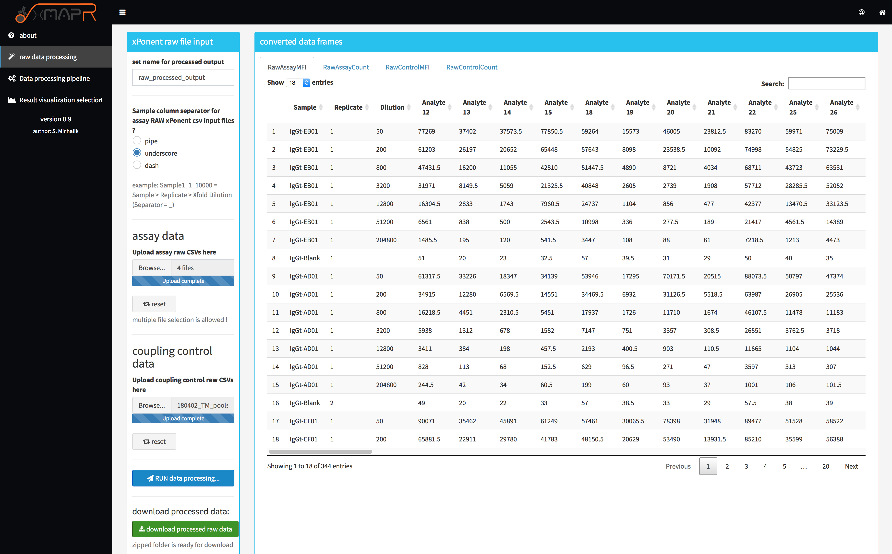{width="60%"}

## xMAPr analysis pipeline

the resulting files from the raw file processing step are mandatory for the analysis with xMAPr:

1. assay MFI file 
2. assay bead count file
3. coupling control MFI file
4. coupling control bead count file
5. sample meta data (additional file !)

In addition to the above mentioned files several parameters can be set (figure 3).

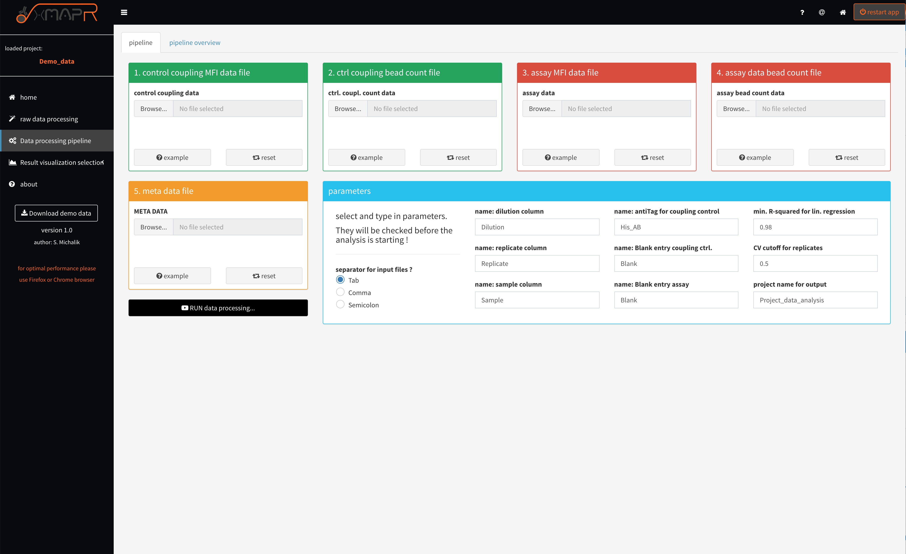{width="60%"}

In the first instance, the data are corrected for their measurement background, bead count and normalized to their respective coupling efficiency. This is followed by the process of sequential multiple regression. Here, a saturation curve regression model is first assumed and calculated by means of "non-least squared". If such a calculation is not possible, a linear regression is assumed. If this calculation is successful, even a 50-fold dilution of the patient sample is still in the linear range and the respective antigen thus shows a very low immune response. In order to obtain individual quantitative values per patient and antigen, the different individual regression curves had to be converted into a meaningful value, whereby the antibody titer, which is represented over the individual dilution stages, represents the most important quantitative quantity. Here, in the saturation curve model, the half-maximal intensity was multiplied by the reciprocal dilution at the half-maximal intensity (e.g., half maximal norm. MFI intensity = 50 / dilution at half maximal norm. MFI intensity = 0.001 --> 50 * 1 / 0.001 = immune response of 50,000). Linear regression multiplies the first serial dilution step by the intensity at that step. This results in a very small quantitative value.

xMAPr will perform multiple regression modeling on the data of each sample/antigen combination and subsequently decide which fit type is most characteristic for the sample/antigen specific data (decision tree figure 5)

### Decision tree

The decision tree was build to elucidate the best fit for the data.
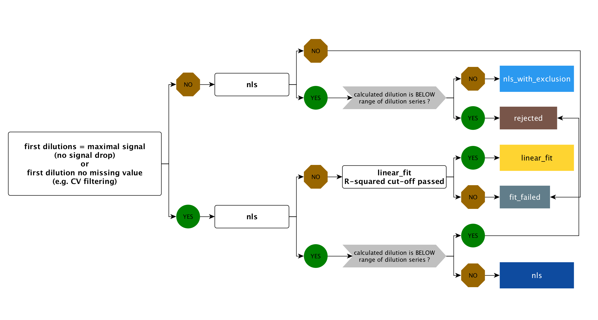{width="60%"}


[insepct fit decision tree](xMAPr_manual/figures/fit_decision_tree_small.png){target="_blank"}

### unspecifc binding issue (ubi) fit

Two new parameters have been introduced since version 2.0.

- method for data processing (selection of fit processing: default is hook binding detection)
- ubi response ratio cutoff (cutoff for leave out saturation curve fit (to min. of 5 dilution stages) response calculation ratio (all data piont fit / leave out fit) for resolving unspecific binding issues)

The **hook** method is the standard approach (*default*) where a saturation fit is executed using all data points, both with and without the application of the hook effect detection algorithm.

The **hook+ubi** method carries out a fit utilizing all data points. If this is successful, it iteratively excludes (from the lowest dilution stage) from one to the entire range of dilutions until only 5 valid data points remain (for each step a saturation curve fit is carried out). If the calculated response from the saturation fit with all data points is similar to the response without dilutions, the fit with all data points is used for categorization in the non-linear least squares (nls) fit decision tree. However, if the response exceeds the *ubi response ratio cutoff*, the fit excluding the dilution is considered.
If the fit with all data points did not succeed but the ones without some dilution the first best fit is used for the nls fit.

#### Example for **hook+ubi**

##### example 1

Lets say you have measured 8 dilutions from one sample (50fold, 100fold, 500fold, 5000fold, 10000fold, ...)

|fit | response | response ratio to predecessors|
|:----|:----------|:------------|
|all data points | 1000 | NA|
|without 50fold dil. | 10000 | 10|
|without 50-100fold dil. | 20000 | 2|
|without 50-500fold dil. | 22000 | 1.1|


In this example only 3 left out fits can be performed until 5 valid data points are left.
If the *ubi response ratio cutoff* would be **2** the fit without **50-500fold dil.** would be takes as nls fit.
If the *ubi response ratio cutoff* would be **4** (default) the fit without **without 50fold dil.** would be takes as nls fit.

##### example 2

|fit | response | response ratio to predecessors|
|:----|:----------|:------------|
|all data points | 12000 | NA|
|without 50fold dil. | 14000 | 1.166|
|without 50-100fold dil. | 14500 | 1.0356|
|without 50-500fold dil. | 15000 | 1.0344|

In this example; if the *ubi response ratio cutoff* would be **2** the fit without **all data points** would be takes as nls fit.

>Exercise caution when using the method and be aware that variations in pipetting can occur based on the volume and the specific pipette used for the dilution!

## xMAPr data inspection

In addition to the data analysis pipeline xMAPr possess a interactive data inspection modul, which allows the user to easily check the fits and the resulting response values.

###global analysis inspection (Screenshots)

{width="60%"}

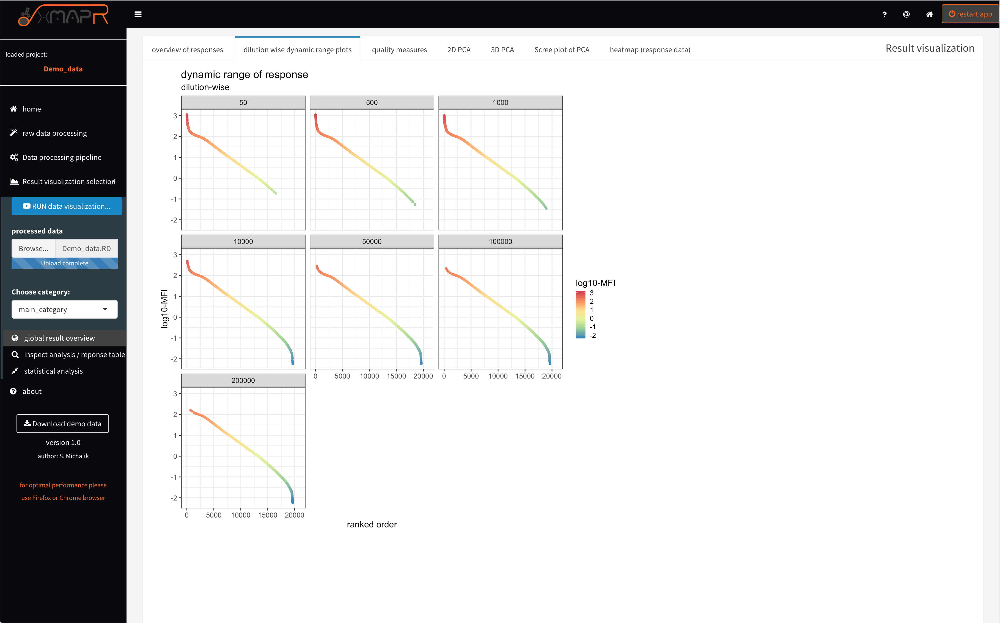{width="60%"}


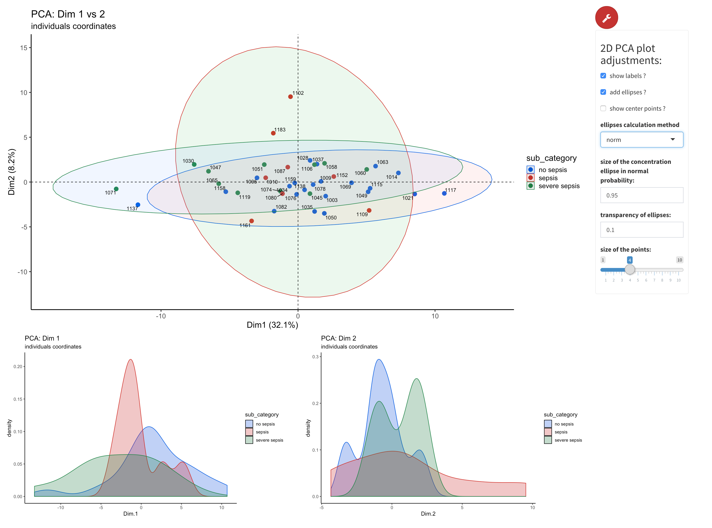{width="60%"}

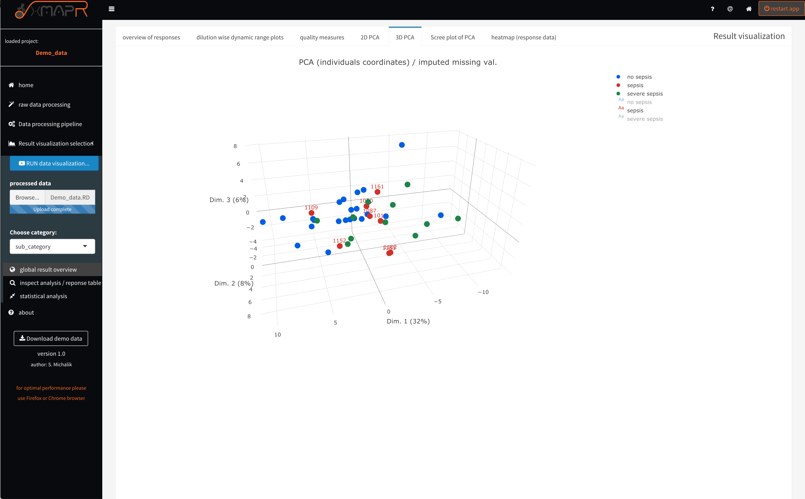{width="60%"}

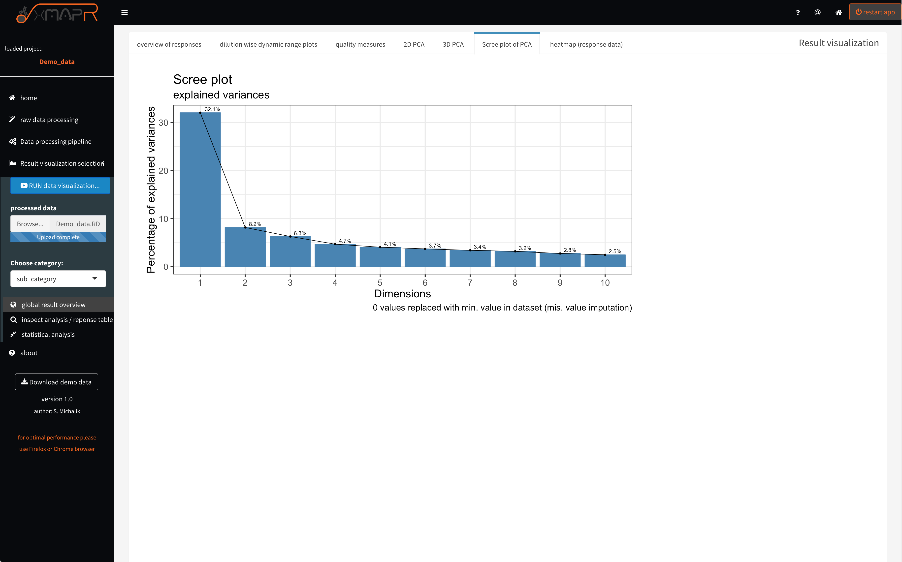{width="60%"}

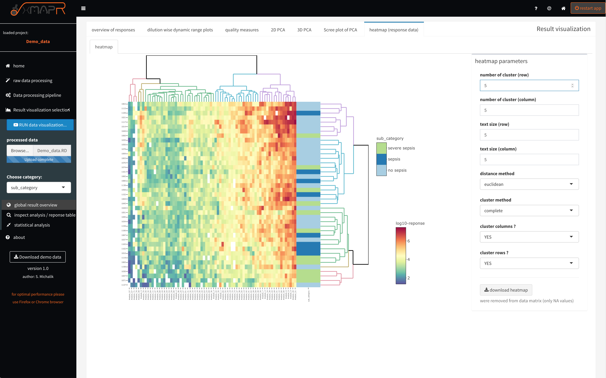{width="60%"}


### global analysis inspection: quality check of data (Screenshots)

It is important to evaluate the data quality. Therefore basic measures like the bead count or coefficient of variation between replicates are very informative
in terms of quality.
A bead count below 35 beads resulting by default (factory suggestion) in a missing value since the MFI (Median fluorescence intensity) is unsure using only 35 beads or below.

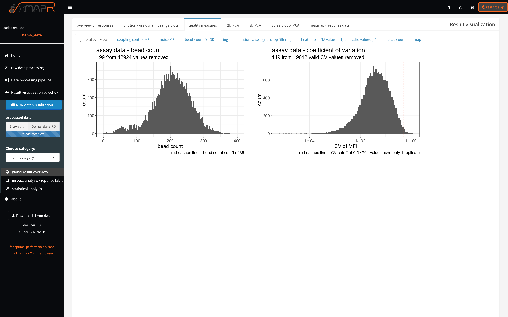{width="60%"}

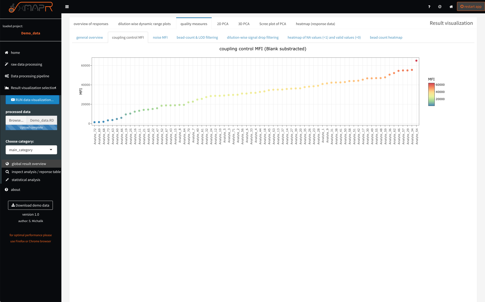{width="60%"}

The MFI of the coupling control represents the loading of the beads with the individual antigens, which can be different but should not be very low to keep a certain dynamic range for the detection of the antibody titer.

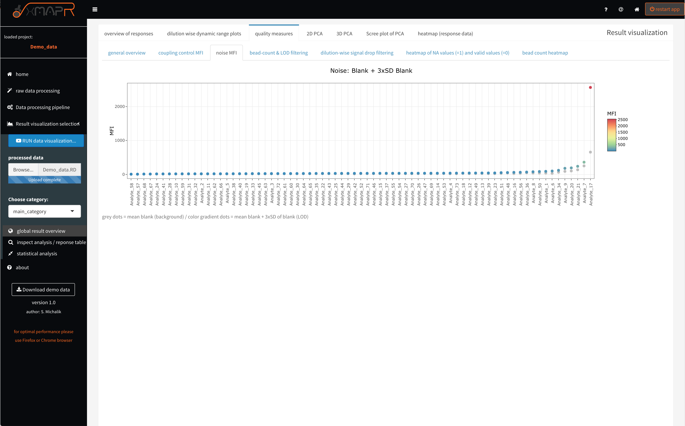{width="60%"}

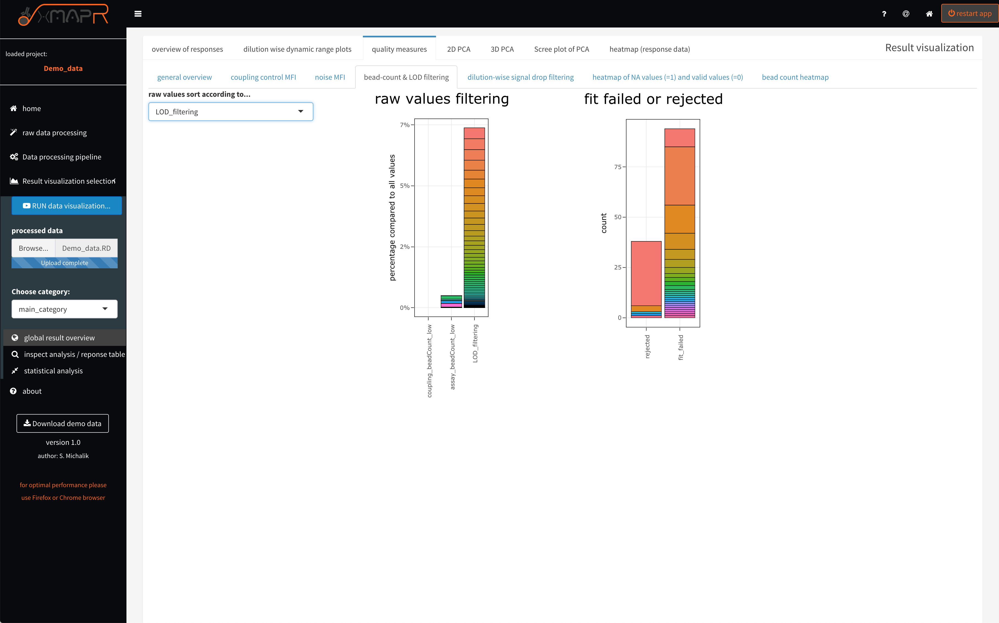{width="60%"}
The stacked barplot of the "values filtered stacked barplot" tab are displaying the filtering for low bead count, for CV filtering and showing how many fits failed or get rejected and in which dilutions how many signal drops were detected.

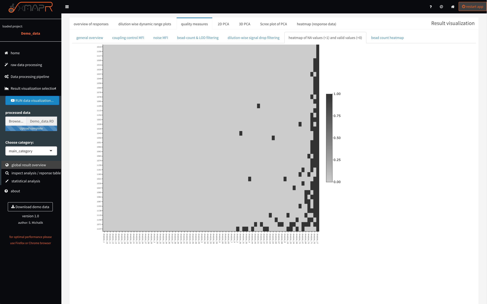{width="60%"}
The missing value heatmap depicts in a compact format were and how many values are missing the the dataset after the response calculation was performed.

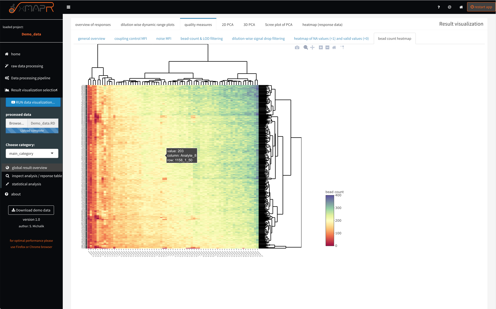{width="60%"}
The bead count heatmap is designed for quickly identifying problematic antigens or patient samples, which often resulting in a low bead count.


### single antigen/sample inspection (Screenshots)

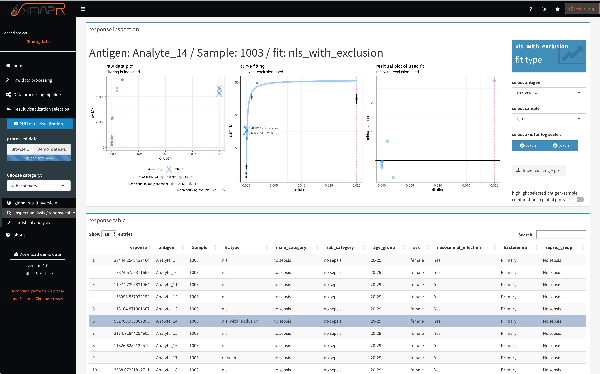{width="60%"}

### statistical analysis of calculated response data  (Screenshots)

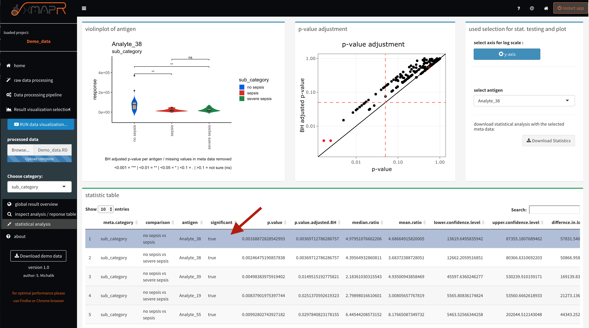{width="60%"}


