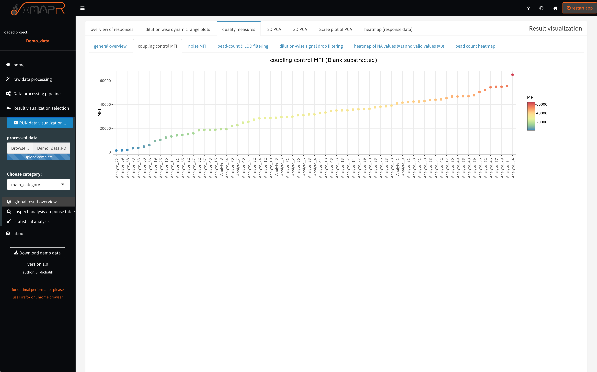
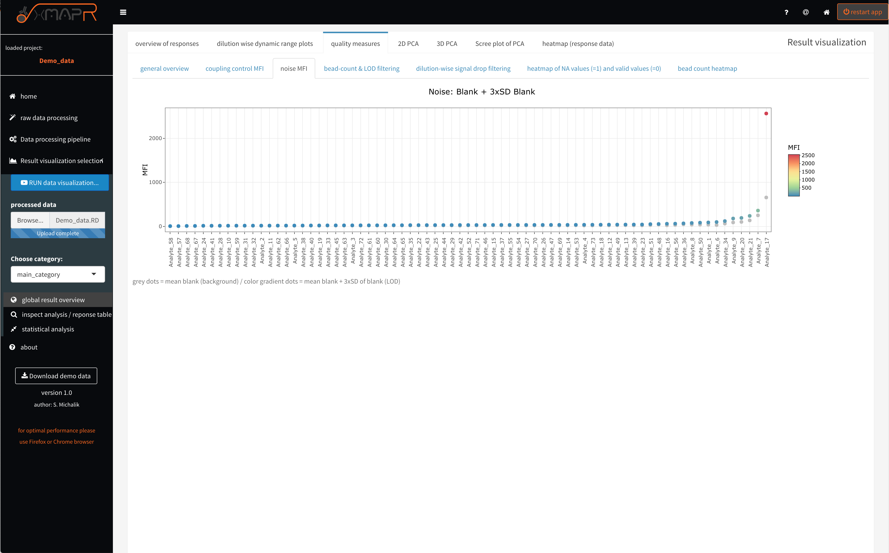

# xMAPr

xMAPr was developed to analyze and visualize data from bead-based experiments performed with the xMAP® technology. The whole basis of the the analysis is the utilization of serial dilutions per sample to avoid saturation effects. Figure \@ref(fig:xMAPrWorkflow) illustrates the mode of operation of xMAPr. 


```{r xMAPrWorkflow,echo=F,fig.cap="xMAPr workflow depicted as flow chart",fig.align='center'}
knitr::include_graphics("figures/xMAPr_analysis_workflow_version2_updated.png")
```
[insepct workflow flow chart](figures/xMAPr_analysis_workflow_version2_updated.png){target="_blank"}

## xMAPr Analysis

### xPONENT® raw data processing

For the analysis several files are mandatory. After you performed the serological assay including a coupling control the resulting csv-files can be exported using the xPONENT® software from Luminex® (Figure \@ref(fig:xPonentCSVexport)). The resulting files can be imported into xMAPr, which will automatically genrate the correct input files for the analysis.


```{r xPonentCSVexport,echo=F,fig.cap="xPonent csv-file export",fig.align='center'}
knitr::include_graphics("figures/xPonent_export.png")
```
[inspect xPonent csv-file export](figures/xMAPr_analysis_workflow.png){target="_blank"}


The gerated raw input files can be inspected and manipulated after prepartion since they are stored as easily accessible txt-files in case of naming errors or removale of specific samples for the later analysis (e.g. included standard wells to monitor the inter-plate reproduceability).

If multiple csv-files should be used for the generation of the xMAPr input files, make sure to store them all in one folder for the upload selection. When all necessary files are selected start processing the data by clicking on the "Run data processing"-button. When processing is done you can download the raw txt-files as a zip-folder by clicking on the green download button.

```{r xMAPrxPONENT,echo=F,fig.cap="xMAPr xPONENT® raw file  processing screenshot",fig.align='center'}
knitr::include_graphics("figures/xPONENT_raw_file_processing.png")
```
[inspect xMAPr xPONENT® raw file  processing screenshot](figures/xPONENT_raw_file_processing.png){target="_blank"}


### xMAPr analysis pipeline

the resulting files from the raw file processing step are mandatory for the analysis with xMAPr:

1. assay MFI file 
2. assay bead count file
3. coupling control MFI file
4. coupling control bead count file
5. sample meta data (additional file, which provides all the sample meta data !)

In addition to the above mentioned files several parameters can be set (figure \@ref(fig:xMAPrPipeline)).

```{r xMAPrPipeline,echo=F,fig.cap="xMAPr anaylsis pipeline screenshot",fig.align='center'}
knitr::include_graphics("figures/pipeline.png")
```
[inspect xMAPr anaylsis pipeline screenshot](figures/pipeline.png){target="_blank"}

If a naming parameter does not fit the input data frames the pipeline will detect that and will report the error in a pop-up error message.

**What will be checked?**

- is the used dilution name found in assay data header
- is the used dilution name found in assay bead count data header
- is the used dilution name found in assay data header
- is the used replicate name found in assay bead count data header
- is the used sample name found in assay data header
- is the used sample name found in assay bead count data header
- is the used sample name found in meta data header
- is the used blank name found in assay data first column
- is the used blank name found in assay bead count data first column
- is the used antiTag name found in coupling control data first column
- is the used antiTag name found in coupling control bead count data first column
- is the used blank name found in coupling control data first column
- is the used blank name found in coupling control bead count data first column
- do assay data and control coupling data share the same number of antigens or antigens and do they have the same order
- do assay bead count data and control coupling bead count data share the same number of antigens and do they have the same order
- do control coupling bead count data and control coupling data share the same number of antigens or antigens and do they hove the same order
- is the used number of dilutions below 5 (min. 5 different dilutions required !)


```{r pipelineError,echo=F,fig.cap="xMAPr anaylsis pipeline error pop-up (used antiTag name was wrong) ",fig.align='center'}

```


In the first instance of the pipeline, the data are corrected for their measurement background, bead count and normalized to their respective coupling efficiency. This is followed by the process of sequential multiple regression. Here, a saturation curve regression model is first assumed and calculated by means of "non-least squared". If such a calculation is not possible, a linear regression is assumed. If this calculation is successful, even a 50-fold dilution of the patient sample is still in the linear range and the respective antigen thus shows a very low immune response. In order to obtain individual quantitative values per patient and antigen, the different individual regression curves had to be converted into a meaningful value, whereby the antibody titer, which is represented over the individual dilution stages, represents the most important quantitative quantity. Here, in the saturation curve model, the half-maximal intensity was multiplied by the reciprocal dilution at the half-maximal intensity `(e.g., half maximal norm. MFI intensity = 50  & dilution at half maximalnorm. MFI intensity  = 0.001 --> 50 * (1 / 0.001) = immune response of 50,000)`. Linear regression multiplies the first serial dilution step by the intensity at that step. This results in a very small quantitative value.

xMAPr will perform multiple regression modeling on the data of each sample/antigen combination and subsequently decide which fit type is most characteristic for the sample/antigen specific data (decision tree figure \@ref(fig:xMAPrDecTree))

#### Decision tree

The decision tree was build to elucidate the best fit for the data.
```{r xMAPrDecTree,echo=F,fig.cap="xMAPr decision tree"}
knitr::include_graphics("figures/fit_decision_tree_small.png")
```
[inspect xMAPr decision tree](figures/fit_decision_tree_small.png){target="_blank"}


##### unspecifc binding issue (ubi) fit

Two new parameters have been introduced since version 2.0.

- method for data processing (selection of fit processing: default is hook binding detection)
- ubi response ratio cutoff (cutoff for leave out saturation curve fit (to min. of 5 dilution stages) response calculation ratio (all data piont fit / leave out fit) for resolving unspecific binding issues)

The **hook** method is the standard approach (*default*) where a saturation fit is executed using all data points, both with and without the application of the hook effect detection algorithm.

The **hook+ubi** method carries out a fit utilizing all data points. If this is successful, it iteratively excludes (from the lowest dilution stage) from one to the entire range of dilutions until only 5 valid data points remain (for each step a saturation curve fit is carried out). If the calculated response from the saturation fit with all data points is similar to the response without dilutions, the fit with all data points is used for categorization in the non-linear least squares (nls) fit decision tree. However, if the response exceeds the *ubi response ratio cutoff*, the fit excluding the dilution is considered.
If the fit with all data points did not succeed but the ones without some dilution the first best fit is used for the nls fit.

###### Example for **hook+ubi**

####### example 1

Lets say you have measured 8 dilutions from one sample (50fold, 100fold, 500fold, 5000fold, 10000fold, ...)

|fit | response | response ratio to predecessors|
|:----|:----------|:------------|
|all data points | 1000 | NA|
|without 50fold dil. | 10000 | 10|
|without 50-100fold dil. | 20000 | 2|
|without 50-500fold dil. | 22000 | 1.1|


In this example only 3 left out fits can be performed until 5 valid data points are left.
If the *ubi response ratio cutoff* would be **2** the fit without **50-500fold dil.** would be takes as nls fit.
If the *ubi response ratio cutoff* would be **4** (default) the fit without **without 50fold dil.** would be takes as nls fit.

####### example 2

|fit | response | response ratio to predecessors|
|:----|:----------|:------------|
|all data points | 12000 | NA|
|without 50fold dil. | 14000 | 1.166|
|without 50-100fold dil. | 14500 | 1.0356|
|without 50-500fold dil. | 15000 | 1.0344|

In this example; if the *ubi response ratio cutoff* would be **2** the fit without **all data points** would be takes as nls fit.

>Exercise caution when using the method and be aware that variations in pipetting can occur based on the volume and the specific pipette used for the dilution!

### xMAPr data inspection

In addition to the data analysis pipeline xMAPr possess a interactive data inspection modul, which allows the user to easily check the fits and the resulting response values.

#### global analysis inspection (Screenshots)


```{r globalResultOverview,echo=F,fig.cap="xMAPr anaylsis output data inspection >> global overview",fig.align='center'}
knitr::include_graphics("figures/global_result_overview.png")
```
[inspect xMAPr anaylsis output data inspection >> global overview](figures/global_result_overview.png){target="_blank"}

The `overview of responses` (figure \@ref(fig:globalResultOverview)) tab depicts the used fit count histogram (figure \@ref(fig:globalResultOverview) **left plot**), which should have a majority of *nls* (non-least squared) fits (saturation curve fits). 

A *nls_with_exclusion* fit - is a nls fit that appears to posses a signal drop in the first sample dilutions in the measured curve. This happens if the secondary antibody **did not saturate the bound sample antibodies on the bead**. Therefore the automatic detection of a signal drops in the dilution response curve will flagged and not use the responsible data points for the fit (*nls_wih_exclusion*).

If linear fits were used for the majority of curve fittings the used serial dilution range did not end up in a saturation making a saturation curve fit impossible. The resulting response data should be used carefully ! In that case a one dilution data analysis is more reasonable.

The dynamic range of responses plot (figure \@ref(fig:globalResultOverview) **center plot**) depicts the dynamic range which is covered by the data over all sample and antigen combinations used.
```{r globalResultOverview1,echo=F,fig.cap="xMAPr anaylsis output data inspection >> global overview (interactive hover feature)",fig.align='center'}
knitr::include_graphics("figures/global_result_overview1.png")
```
[inspect xMAPr anaylsis output data inspection >> global overview (interactive hover feature)](figures/global_result_overview1.png){target="_blank"}

The fit type histogram ((figure \@ref(fig:globalResultOverview) **right plot**) displays the used fit histogram in correlation to the calculated response. In the example screenshot it apparent that the *nls_with_exclusion* is primarily being used in the high response range. This makes sense since a high sample antibody titer against one antigen is resulting in a very high load of the sample antibodies on the individual bead. Thus a signal drop in the very first dilutions (low sample dilution) are more likely to happen.


The `dilution wise dynamic range plots` (figure \@ref(fig:dynamicRangeDilutionWise)) tab depicts intensity ranked order of sample/antigen combinations (x-axis) versus log. MFI (median fluorescence intensity) (y-axis). The plot is being used for visually estimating the saturation effect (upper and lower LOD) in each dilution used.

```{r dynamicRangeDilutionWise,echo=F,fig.cap="xMAPr anaylsis output data inspection >> dynamic range dilution wise",fig.align='center'}
knitr::include_graphics("figures/global_result_overview_dyn_range_dilution_wise.png")
```
[inspect xMAPr anaylsis output data inspection >> dynamic range dilution wise](figures/global_result_overview_dyn_range_dilution_wise.png){target="_blank"}


#### global analysis inspection: quality check of data (Screenshots)

It is important to evaluate the data quality (figure \@ref(fig:beadCountCVhist); `quality measures > general overview`). Therefore basic measures like the bead count or coefficient of variation between technical replicates are very informative in terms of quality.
A bead count below **35 beads** results by default (factory suggestion) in a missing value since the MFI (Median fluorescence intensity) is unsure using only 35 beads or below.
The CV cut-off can be set in the pipeline settings (figure \@ref(fig:xMAPrPipeline))


```{r beadCountCVhist,echo=F,fig.cap="xMAPr quality measures: bead count and CV histograms"}
knitr::include_graphics("figures/quality_measures__general_overview.png")
```
[inspect xMAPr quality measures: bead count and CV histograms](figures/quality_measures__general_overview.png){target="_blank"}

Since a EDC-NHS coupling of the carboxylated beads with the desired antigens is being used the coupling efficiency might be varying due to the differences in amino acid composition and length of the antigens.
The coupling control plot (figure \@ref(fig:MFIcouplingControl)) displays in a ranked fasion the coupling efficiency measured with a detection antibody directed against the recombinant tag the antigens. The interactive hover feature returns the absolute value measured for each antigen.

The MFI of the coupling control (`quality measures > coupling control`) represents the loading of the beads with the individual antigens, which can be different but should not be very low to keep a certain dynamic range for the detection of the antibody titer.

```{r MFIcouplingControl,echo=F,fig.cap="xMAPr quality measures: MFI of coupling control"}

```
[inspect xMAPr quality measures: MFI of coupling control](figures/quality_measures__coupling_control_MFI.png){target="_blank"}


The noise MFI  (figure \@ref(fig:LOD)) (`quality measures > noise MFI`) depicts the ranked ordered mean BLANK values + 3 x SD of the BLANK values, which is being used to estimate the LOD (limit of detection) for each antigen. Again the interactive hover feature show details for each entigen.

```{r LOD,echo=F,fig.cap="xMAPr quality measures: LOD...limit of detection"}

```

[inspect xMAPr quality measures: LOD...limit of detection](figures/quality_measures__LOD.png){target="_blank"}

The stacked barplots (figure \@ref(fig:BarplotsValueFiltering)) (`quality measures > bead-count and LOD filtering`) are displaying the filtering for low bead count, for CV filtering with the used cut-off and showing how many fits failed or get rejected.

```{r BarplotsValueFiltering,echo=F,fig.cap="xMAPr quality measures: stacked barplots of value filtering"}
knitr::include_graphics("figures/quality_measures__value_filtering.png")
```
[inspect xMAPr quality measures: stacked barplots of value filtering](figures/quality_measures__value_filtering.png){target="_blank"}


```{r BarplotsValueFiltering1,echo=F,fig.cap="xMAPr quality measures: stacked barplots of value filtering (interactive hover)"}
knitr::include_graphics("figures/quality_measures__value_filtering1.png")
```

The implemented signal drop detection alg. uses the maximum value of the measured data points and inspect the data points with a lower dilution begining from the maximal MFI data point (`quality measures > dilution-wise signal drop filtering`). For example signal drops in the first dilution step of the serial dilution range is normal. But also having a huge amount of signal drops in later dilutions is the result of using a low concentration of the detection antibody or the dilution steps were not well choosen.

```{r BarplotsValueFiltering2,echo=F,fig.cap="xMAPr quality measures: stacked barplots of dilution-wise signal drop detection (interactive hover)"}

```
["xMAPr quality measures: stacked barplots of dilution-wise signal drop detection](figures/quality_measures__value_filtering_signal_drop.png){target="_blank"}


The interative hover feature (figure \@ref(fig:BarplotsValueFiltering1)) displays information like which antigen, the count of filtered values and what is the percentage of filtered values form the data matrix. Making it easy to identify problematic antigen or sample candidates.

```{r heatmapNA,echo=F,fig.cap="xMAPr quality measures: NA (missing) value heatmap"}
knitr::include_graphics("figures/quality_measures__NA_value_heatmap.png")
```
[inspect xMAPr quality measures: NA (missing) value heatmap](figures/quality_measures__NA_value_heatmap.png){target="_blank"}

The missing value heatmap (figure \@ref(fig:heatmapNA)) (`quality measures > heatmap of NA values`) depicts in a compact format where and how many values are missing the the dataset after the response calculation was performed.

```{r heatmapBeadCount,echo=F,fig.cap="xMAPr quality measures: bead count heatmap"}
knitr::include_graphics("figures/quality_measures__bead_count_heatmap.png")
```
[inspect xMAPr quality measures: bead count heatmap](figures/quality_measures__bead_count_heatmap.png){target="_blank"}

The bead count heatmap (figure \@ref(fig:heatmapBeadCount)) (`quality measures > bead count heatmap`) is designed for quickly identifying problematic antigens or patient samples over the dilution series, which also often resulting in a low bead count.


#### global data analysis: PCA & heatmap

A first look at the data can be performed in the xMAPr app. A PCA (principle component analysis) is automatically generated plotted and colored based on the selected meta data.

```{r PCA2D,echo=F,fig.cap="xMAPr anaylsis output data inspection >> 2D-PCA of data colored by selected meta data",fig.align='center'}
knitr::include_graphics("figures/global_result_overview_PCA.png")
```
[inspect xMAPr anaylsis output data inspection >> 2D-PCA of data colored by selected meta data](figures/global_result_overview_PCA.png){target="_blank"}

The principle component analysis is performed using the factomineR package with missing values removed. The data centering was done by subtracting the column means (omitting NAs) of the data from their corresponding columns. To unify variances scaling of data was done by dividing the (centered) columns of the data by their standard deviations. The 2D PCA (figure \@ref(fig:PCA2D)) (`2D PCA`) displays the resulting PCA plot. 1D density plots supporting the interpretaion of the PCA results.

The PCA dimension for the plot can be be selected using the *knobs*.  Furthermore advanced plot adjustment like group ellipsis can be set as well using the *"wrench" button*.


```{r PCA3D,echo=F,fig.cap="xMAPr anaylsis output data inspection >> interactive 3D-PCA colored by selected meta data"}
knitr::include_graphics("figures/global_result_overview_PCA3D.png")
```
[inspect xMAPr anaylsis output data inspection >> interactive 3D-PCA colored by selected meta data](figures/global_result_overview_PCA3D.png){target="_blank"}

The 3D PCA (figure \@ref(fig:PCA3D)) (`3D PCA`) displays the resulting PCA plot in the first 3 dimensions.

```{r PCAscreeplot,echo=F,fig.cap="xMAPr anaylsis output data inspection >> screeplot of PCA analysis"}
knitr::include_graphics("figures/global_result_overview_PCA_scree.png")
```
[inspect xMAPr anaylsis output data inspection >> screeplot of PCA analysis](figures/global_result_overview_PCA_scree.png){target="_blank"}

The Screeplot visualize the variances of dimensions of the PCA (figure \@ref(fig:PCAscreeplot)) (`Scree plot of PCA`).

```{r responseHeatmap,echo=F,fig.cap="xMAPr anaylsis output data inspection >> response heatmap"}
knitr::include_graphics("figures/response_heatmap.png")
```
[inspect xMAPr anaylsis output data inspection >> response heatmap](figures/response_heatmap.png){target="_blank"}

The heatamp (figure \@ref(fig:responseHeatmap)) (`heatmap (response data)`) displays the clustered heatmap of the calculated response data. If a sample or a antigen possess only NA values it is excluded from the heatmap, which is indicated in the grey text below the *"download heatmap"* button. The heatmap is fully interactive with hover information feature, zoom and screenshot feature. Furthermore the heatmap can be download in its interative form as html using the *"download heatmap"* button. Several parameters can be set like number of clusters of rows and columns or cluster methods to name a few.


#### single antigen/sample inspection (Screenshots)

```{r SingleResults,echo=F,fig.cap="xMAPr anaylsis output data inspection >> single antigen/sample combination fit inspection"}
knitr::include_graphics("figures/inspect_single_results.png")
```
[inspect xMAPr anaylsis output data inspection >> single antigen/sample combination fit inspection](figures/inspect_single_results.png){target="_blank"}

The single result view (figure \@ref(fig:SingleResults)) (`inspect analysis/response table`) enables a inspection of the data down to raw data level by diplaying the results on a antigen/sample combination basis. The upper panel displays the different presentations of the data. 

The **left plot** displays the raw data and the dashed red line indicate the LOD. In addition detected signal drops were marked with a blue cross.

The **center plot** displays the calulated curve and the curve point, which is being used for the response calculation. The dashed violett vertical line inidcating the lower and upper end of the used dilution steps.

The **right plot** displays the residuals from the used fit.

```{r SingleResults1,echo=F,fig.cap="xMAPr anaylsis output data inspection >> single antigen/sample combination fit inspection (antigen selection)"}
knitr::include_graphics("figures/inspect_single_results1.png")
```
[inspect xMAPr anaylsis output data inspection >> single antigen/sample combination fit inspection (antigen selection) ](figures/inspect_single_results1.png){target="_blank"}


```{r SingleResults2,echo=F,fig.cap="xMAPr anaylsis output data inspection >> single antigen/sample combination fit inspection (log. scale)"}

```
[inspect xMAPr anaylsis output data inspection >> single antigen/sample combination fit inspection (log. scale) ](figures/inspect_single_results2.png){target="_blank"}

When hitting the e.g. log. scale buttons the plots were generated using a log. scale on the selected axis (figure \@ref(fig:SingleResults2)).


One method to choose the antigen and sample which should plotted are the drop down selection list (figure \@ref(fig:SingleResults1)). In the elements the desired selection can also being typed in.


Another method to choose the antigen and sample which should plotted is to use the interactive data table in the lower panel of the inspect analysis/reponse (figure \@ref(fig:SingleResults3).
The desired antigen/sample combination can be directly selected inside the table and when looking for a antigen or sample the search field is very helpful.


```{r SingleResults3,echo=F,fig.cap="xMAPr anaylsis output data inspection >> single antigen/sample combination fit inspection (interactive data table)"}
knitr::include_graphics("figures/inspect_single_results3.png")
```
[inspect xMAPr anaylsis output data inspection >> single antigen/sample combination fit inspection (interactive data table) ](figures/inspect_single_results3.png){target="_blank"}


In addition if the `highlight select antigen/sample combination in global plots?` is being switch on the selected antigen/sample combination is being marked in the global plots (figure \@ref(fig:SingleResultsMarked1) & \@ref(fig:SingleResultsMarked2)).

```{r SingleResultsMarked1,echo=F,fig.cap="xMAPr anaylsis output data inspection >> single antigen/sample combination marked in global dynamic range plots over dilutions"}
knitr::include_graphics("figures/inspect_single_results2_dyn_range.png")
```
[xMAPr anaylsis output data inspection >> single antigen/sample combination marked in global dynamic range plots over dilutions ](figures/inspect_single_results2_dyn_range.png){target="_blank"}


```{r SingleResultsMarked2,echo=F,fig.cap="xMAPr anaylsis output data inspection >> single antigen/sample combination marked in global dynamic range plots"}
knitr::include_graphics("figures/inspect_single_results2_dilution_wise_range.png")
```
[xMAPr anaylsis output data inspection >> single antigen/sample combination marked in global dynamic range plots ](figures/inspect_single_results2_dilution_wise_range.png){target="_blank"}

#### statistical analysis of calculated response data  (Screenshots)

The statistical data analysis is based on samples groups defined by the selected meta data.
A wilcox rank sum test is performed using multiple test correction if the number of groups are more than two.
The test statistics with p-value, adjusted p-value and confidence intervals etc. can be interactively inspected and the data is plotted using a violin plot with a bars indicating significant changes.


```{r ResponseStats,echo=F,fig.cap="xMAPr anaylsis output data inspection >> statistical anaylsis using a wilcox ranked sum test on sample reponse data and the the selcted meta data for grouping"}
knitr::include_graphics("figures/statistical_analysis.png")
```
[inspect xMAPr anaylsis output data inspection >> statistical anaylsis using a wilcox ranked sum test on sample reponse data and the the selcted meta data for grouping](figures/statistical_analysis.png){target="_blank"}

```{r ResponseStats1,echo=F,fig.cap="xMAPr anaylsis output data inspection >> statistical anaylsis using a wilcox ranked sum test on sample reponse data and the the selcted meta data for grouping (meta data selection)"}

```
[inspect xMAPr anaylsis output data inspection >> statistical anaylsis using a wilcox ranked sum test on sample reponse data and the the selcted meta data for grouping (meta data selection)](figures/statistical_analysis1.png){target="_blank"}
